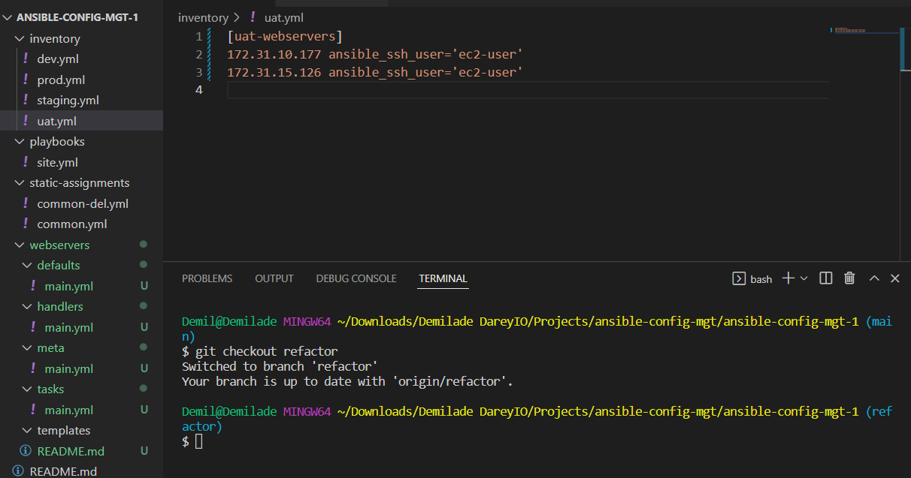

## jenkins job enhancement

creating new directory in jenkins-ansible server to store artifacts

`$ sudo mkdir /home/ubuntu/ansible-config-artifact`

change dir permission so jenkins can save files there

`$ chmod -R 777 /home/ubuntu/ansible-config-artifact`

installing copy artifact plugin on jenkins

creating freestyle project, save_artifacts, and configuring it to be triggered upon completion of the ansible project

the artifacts will be saved into /home/ubuntu/ansible-confi-artifact dir

configuring /home/ubuntu/ansible-config-artifact to allow jenkins have access 

`$ sudo apt install acl -y`

this command should be used on each dir: /home, /ubuntu...

`$ sudo setfacl -m u:jenkins:rwx /home/ubuntu/ansible-config-artifact/`

`$ ls /home/ubuntu/ansible-config-artifact`

## refactoring ansible code by importing other playbooks into site.yml

creating new file, site.yml, inside playbooks dir

creating new dir, static-assignments, inside the repo

moving common.yml inside static-assignments dir

importing common.yml playbook inside site.yml file

creating another playbook, common-del.yml, to run against dev servers

updating site.yml file with common-del.yml playbook 

editing /etc/ansible file to include inventory path containing all the servers ip address in the config file

`$ sudo vi /etc/ansible/ansible.cfg`

` inventory = /home/ubuntu/ansible-config-artifact/inventory`

pinging the servers via ansible to be sure they are accessible

`$ ansible all -m ping`

running site.yml against dev.yml 

`$ ansible-playbook -i inventory/dev.yml playbooks/site.yml`

confirming the code worked by ssh-ing into each webserver to confirm wireshark has been deleted

`$ ssh@public-ip-address`

`$ which wireshark`

`$ wireshark --version`

## configuring uat webservers with a role webserver

launched two new ec2 instances for the uat webservers

created webserver dir

inside webserver dir, created readme.md file, defaults dir, main.yml inside defaults...

screenshot:

updating uat.yml file with uat webservers ip addresses

edited /etc/ansible to add full path to roles dir

`$ sudo vi /etc/ansible/ansible.cfg`

`$ roles_path = /home/ubuntu/ansible_config_artifact_roles`

populating main.yml file with tasks to:

install & configure apache

clone tooling website from github

ensure tooling website code is deployed to /var/www/html on each of the 2 uat webservers

make surre httpd service is started

creating uat-webservers.yml assignment within static-assignments dir to reference roles

importing uat-webservers.yml in site.yml file

